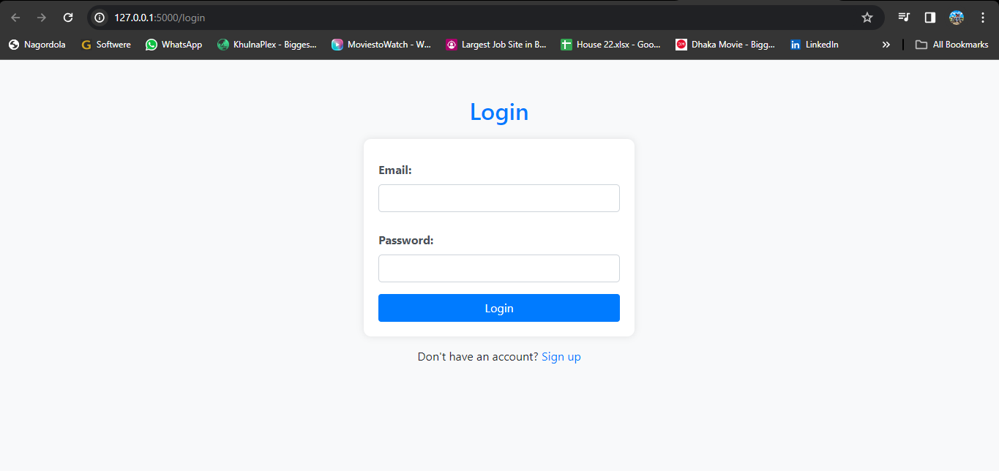
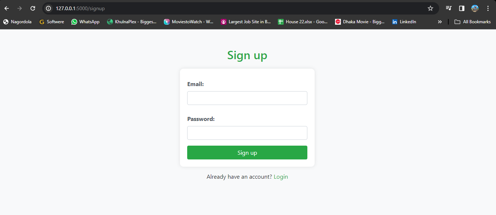
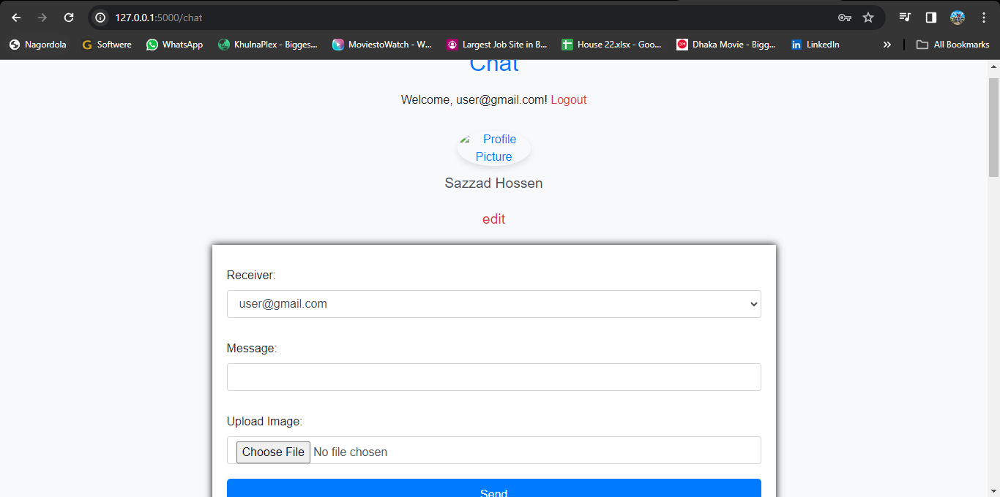
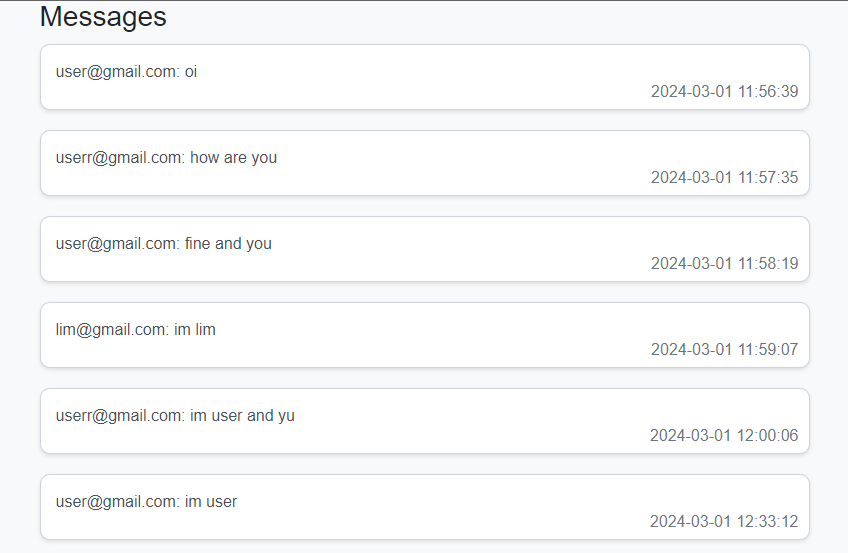
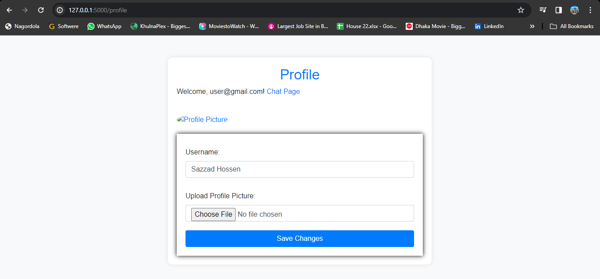

# Flask-Online-Secure-Chatting-System

The provided Flask application facilitates a real-time chat system with user authentication, allowing users to exchange messages and images. It utilizes SQLAlchemy for database management, integrating a User model for account details and a Message model to store chat messages. User authentication is handled through Flask-Login, securing routes and ensuring that only authenticated users can access certain functionalities.

# HINT: ANYONE CAN MAKE IT MORE COMFORTABLE AND PERFECT....

  
  
  
  
  

The application incorporates Bootstrap for a visually appealing and responsive frontend. Users can log in, sign up, and access their chat interface, where they can send messages, including image uploads. The profile section enables users to personalize their accounts by updating usernames and profile pictures.

Furthermore, file uploads, such as images, are securely handled with restrictions on allowed file formats. The application persists user data and messages in a SQLite database. For an enhanced user experience, the chat interface displays user profile pictures and usernames. The application structure adheres to Flask best practices, enhancing maintainability and scalability. Overall, this Flask chat application provides a comprehensive and user-friendly platform for interactive communication.
